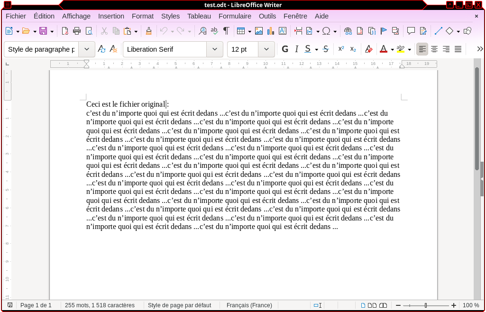
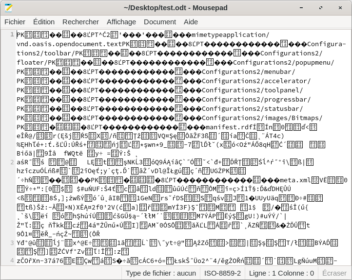
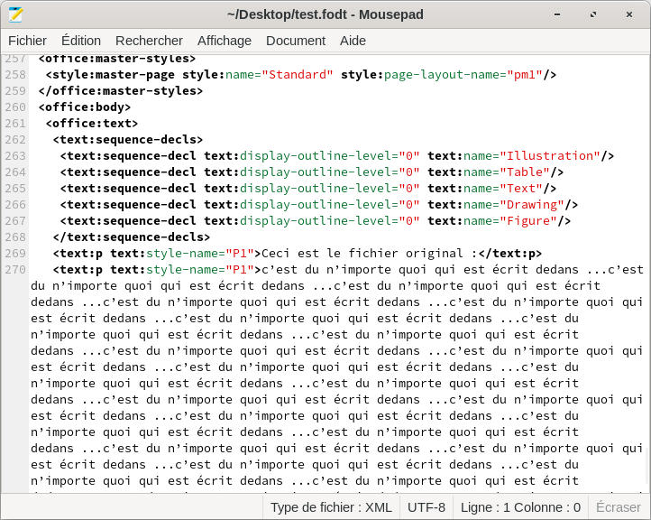
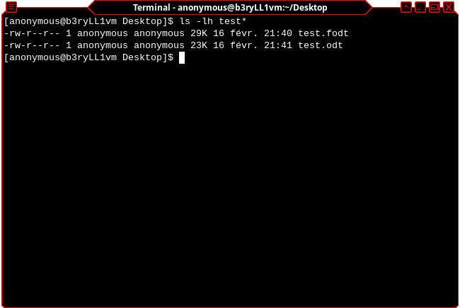

# Le format flat XML de libreoffice

## Le contexte

Il est difficile de travailler à plusieurs sur un même document et parfois les connaissances dans des formats ou des langages purement textuels permettant du travail collaboratif, comme par exemple sur un `git` entre collaborateurs d'un même projet.

Depuis plusieurs années les suites bureautiques compressent les fichiers lors de leur enregistrement afin déconomiser l'espace. Une pratique qui date de l'ancien temps si mes souvenirs sont bons où les fichiers bureautiques ont enflés par leurs composition mais les connexions internet n'étaient pas aussi rapides qu'à l'heure actuelle.

## Une solution

Cependant, en observant de plus près les filtres d'enregistrement des suites telles que Microsoft Office et, pour les libristes que nous sommes, Libreoffice, il se trouve qu'un format d'enregistrement existe, format non compressé et qui offre des possibilités intéressantes, le **XML flat**.

Dans ce format, le fichier est tout simplement non compressé, il est comme il devrait être, lisible par un simple éditeur de textes.

Voici un texte rédigé dans libreoffice Writer :



et voici ce qu'est le fichier si on l'ouvre avec un bloc-notes (ici mousepad) :



si maintenant j'enregistre le fichier au format XML-flat (fodt) voilà le résultat dans mousepad :



## L'avantage ?

Om est évident : Pour une modification minime on peut éditer directement le xml et donc la source sans avoir à exécuter libreoffice, on peut même faire ça sur un git (pour de petites retouches évidemement) et seule la partie modifiée (la ou les lignes) seront enregistrées dans un commit.

Une simple modification n'entraîne plus toute la sauvegarde complète du fichier.

Il est possible aussi d'imaginer de copier-coller cela dans un pad collaboratif (type framapad ou etherpad) d'y travailler à plusieurs et enfin de récupérer directement un fichier office ouvrable par les intéressés de l'autre côté des écrans.

## L'inconvénient.

Il y en a sûrement plusieurs, mais suivant la complexité et la structure du document, la taille n'est pas du tout la même, les fichiers **XML flat** n'était pas compressés ils occupent plus d'espace, la contrepartie est que leurs modifications entraînent moins d'espace de stockage demandé puisque seules les lignes modifiées seront l'objet d'un commit.



## La conversion.

Comme je suis sympa, je vous donne même les lignes de commandes pour convertir tous les fichiers (on va dire du répertoire courant) des fichiers libreoffice writer et libreoffice calc :

```bash
lowriter --convert-to fodt *.odt
lowriter --convert-to fods *.ods
```

J'espère que cela vous aidera !

Moane